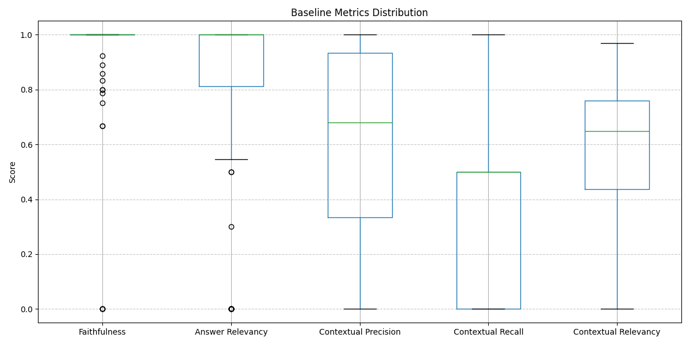
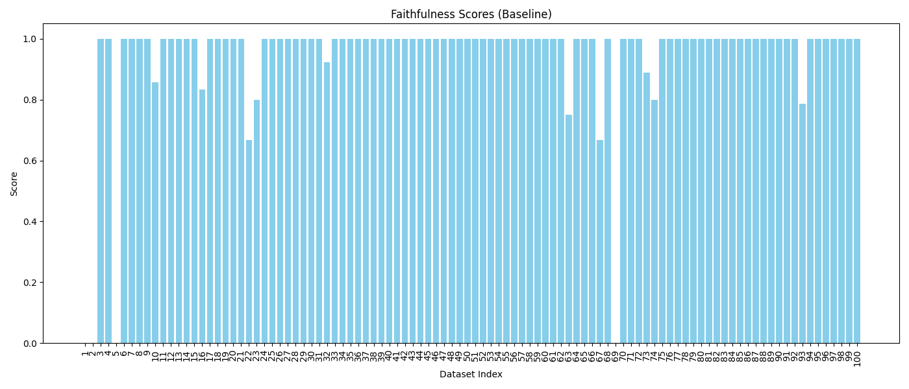
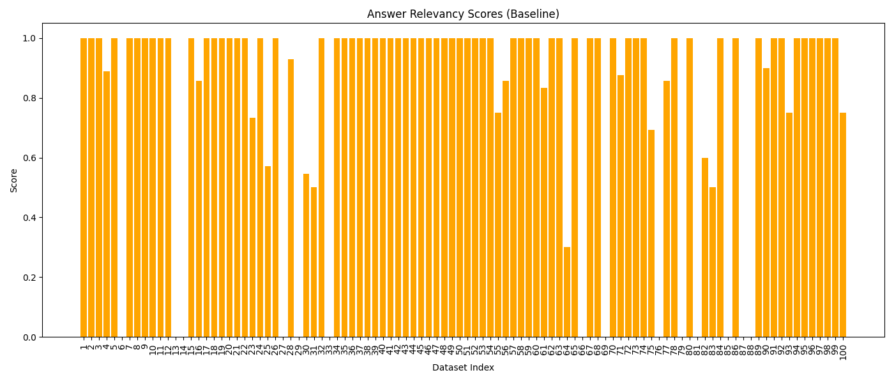
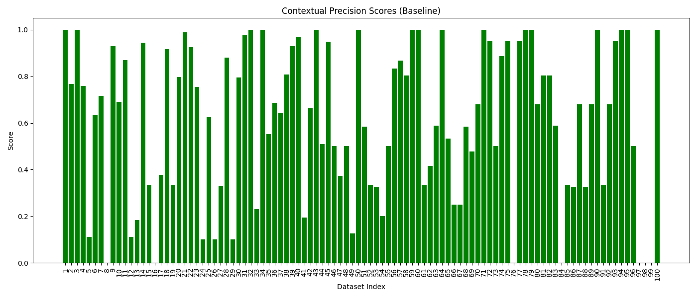
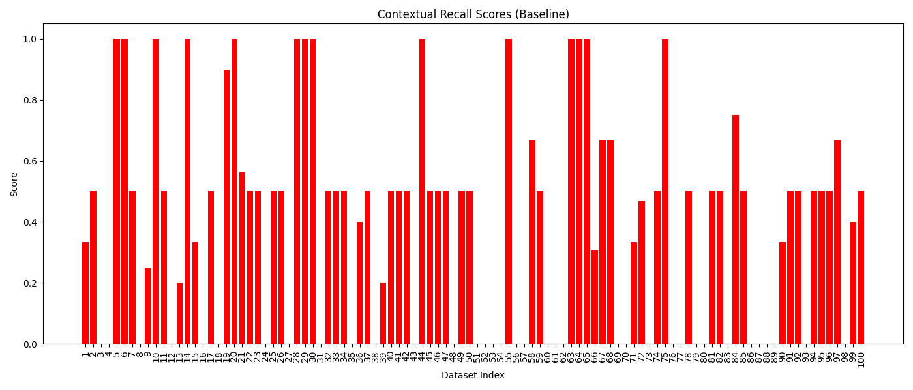
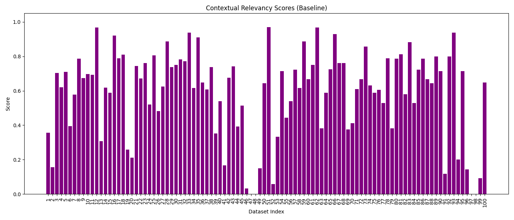

# Baseline RAG Evaluation Summary

This report provides a granular view of the performance metrics for the **original RAG pipeline** across the 50 test cases from the V0.5 dataset.

## Metrics Distribution (Box Plot)
The box plot below shows the overall distribution and variance for each of the 5 evaluation metrics.

## Per-Metric Breakdown (Bar Charts)
Each bar chart represents a specific metric across the dataset indices (1-50).

### Model Performance Metrics

<!-- slide -->

<!-- slide -->

<!-- slide -->

<!-- slide -->

## Summary of Findings

1.  **Faithfulness & Answer Relevancy**: Both metrics perform exceptionally well across the majority of test cases.
2.  **Contextual Precision**: Shows a varied distribution, indicating that relevant context isn't always ranked at the very top.
3.  **Contextual Recall**: Features a massive cluster of scores at exactly **0.50**, confirming the "meta-commentary" issue in the ground truth answers.
4.  **Contextual Relevancy**: Exhibits significant noise, reflecting inconsistent retrieval quality.
