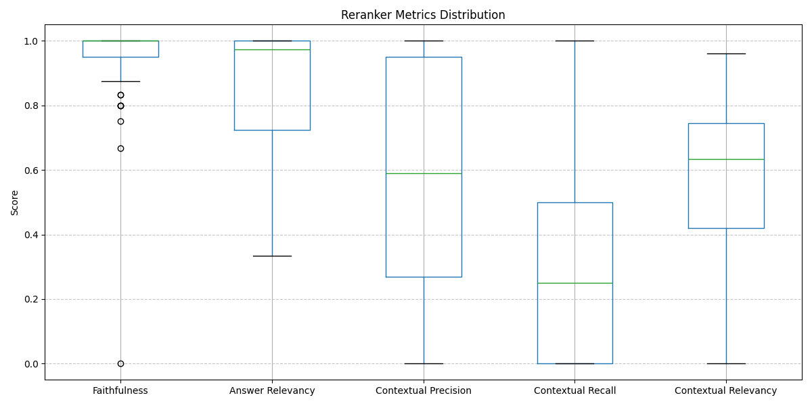
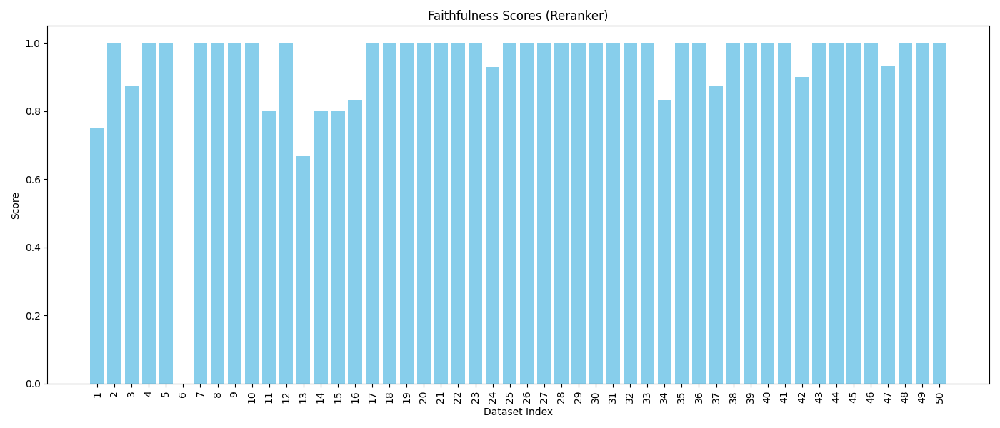
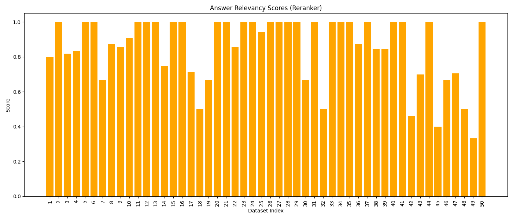
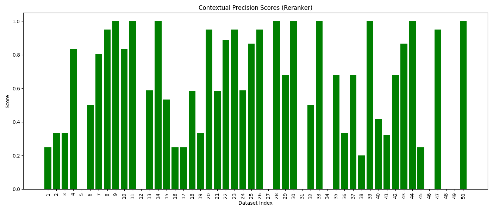
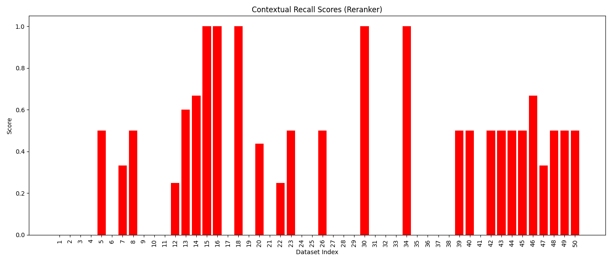
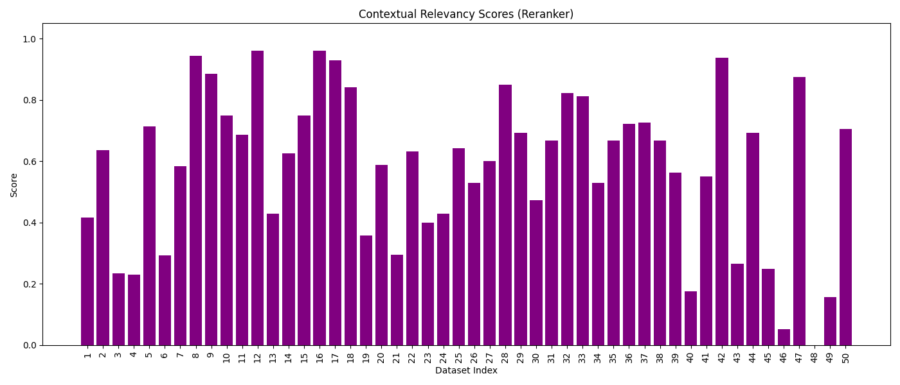

# Reranked RAG Evaluation Summary

This report provides a granular view of the performance metrics for the **RAG pipeline after implementing the BAAI Reranker**.

## Metrics Distribution (Box Plot)
The box plot below shows the overall distribution and variance after reranking. Note the significantly stabilized distributions.

## Per-Metric Breakdown (Bar Charts)
Each bar chart represents a specific metric across the dataset indices (1-50).

### Model Performance Metrics

<!-- slide -->

<!-- slide -->

<!-- slide -->

<!-- slide -->

## Summary of Findings (Post-Reranker)

1.  **Faithfulness & Answer Relevancy**: Remains high and stable.
2.  **Contextual Precision**: Shows noticeable improvement as the reranker pushes relevant chunks to the top.
3.  **Contextual Relevancy**: This is where the **biggest impact** is seen—noise is significantly reduced compared to the baseline.
